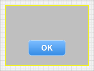

Why use WeView v2?
==

<!-- TEMPLATE START -->

There are some similarities between WeView and iOS Auto Layout.  Both provide a declarative syntax for specifying layout.  

But while WeView works in terms of laying out groups of subviews using concepts such as alignment, margins and spacing, iOS Auto Layout operates a finer conceptual level, requiring you to individually specify values for properties like the x or y position, width or height of a single subview.  iOS UI code is already verbose and difficult to maintain; iOS Auto Layout exacerbates this problem.  

_Here's a simple comparison_, based on Apple's sample code that centers a button at the bottom of it's superview bounds with 20pt spacing.

Here's the layout using _iOS Auto Layout_:



iOS Auto Layout also supports a _Visual Format Language_.  Here's the same layout using _VFL_:



Here's the equivalent logic using a _WeView_:



_WeView v2 is designed to yield concise, expressive and maintainable code_	.  The benefits of the syntax only become more clear as layouts become more complex.

* iOS Auto Layout is constraint-based.  _Constraints are a powerful but awkward way to describe layouts_. 
* iOS Auto Layout constraints are specified on a per-view basis. WeView allow you to layout views in groups.
* With iOS Auto Layout you need to worry about complications such as _constraint priority, constraint sufficiency, constraint conflicts, ambiguous layout, common ancestors_, etc.  It is easy to run afoul of these issues and they complicate refactoring and redesign.  None of those problems apply to WeView v2.

### Why _not_ to use WeView v2

* iOS Auto Layout has the advantage of being integrated into Interface Builder.  The support for iOS Auto Layout in Interface Builder has dramatically improved in Xcode 5.  _Bear in mind that WeView v2 can only be used programmatically_.

### Other Alternatives:

* [ReactiveCocoaLayout](https://github.com/ReactiveCocoa/ReactiveCocoaLayout) is another alternative to iOS Auto Layout built on [ReactiveCocoa](https://github.com/ReactiveCocoa/ReactiveCocoa).  

<!-- TEMPLATE END -->

Next\: [Tutorial 1: Overview](Tutorial1.html)